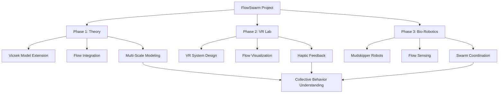
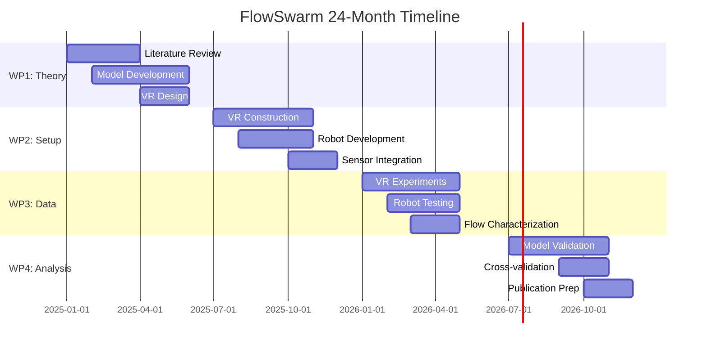
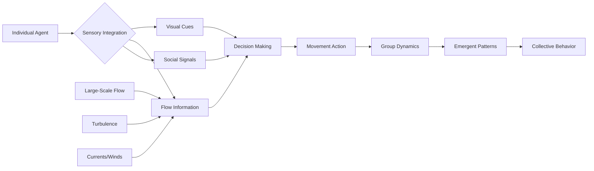
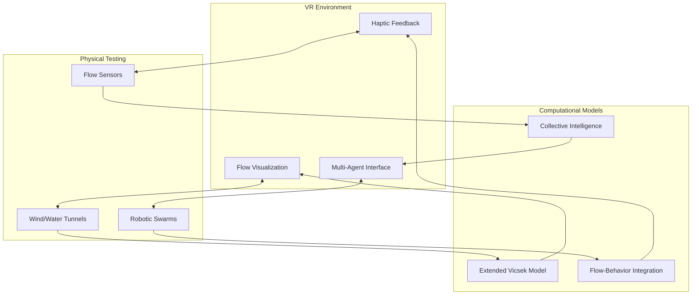
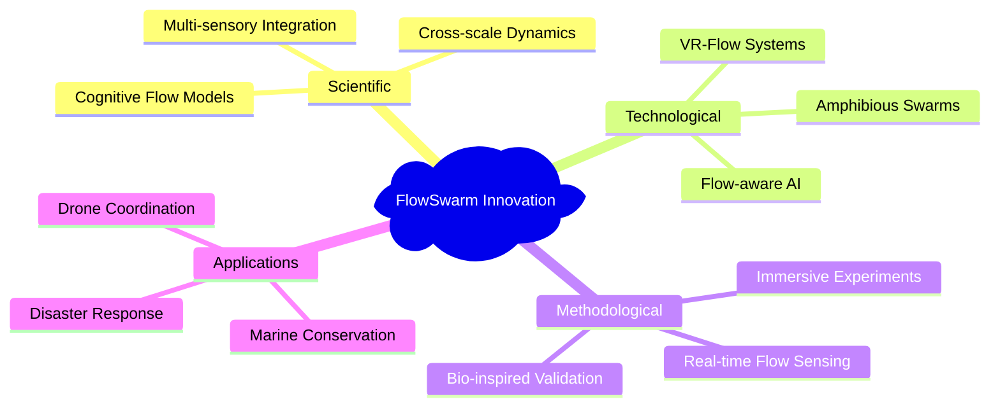
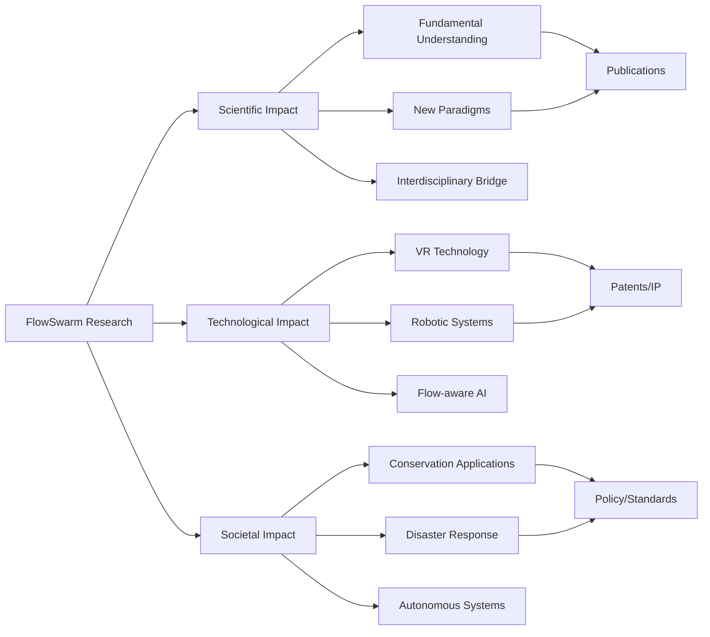
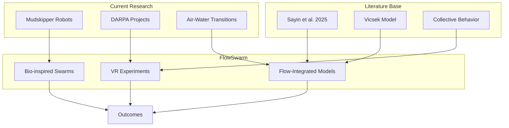

# FlowSwarm Project Visualization

## Project Overview Diagram

## Timeline Visualization

## Conceptual Framework

## System Architecture

## Innovation Mapping

## Impact Visualization

## Research Integration

